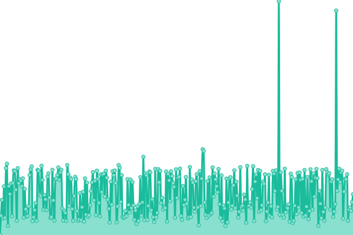
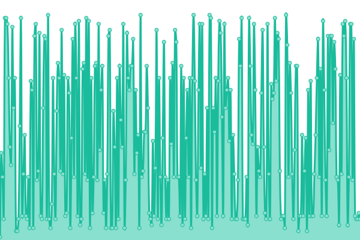
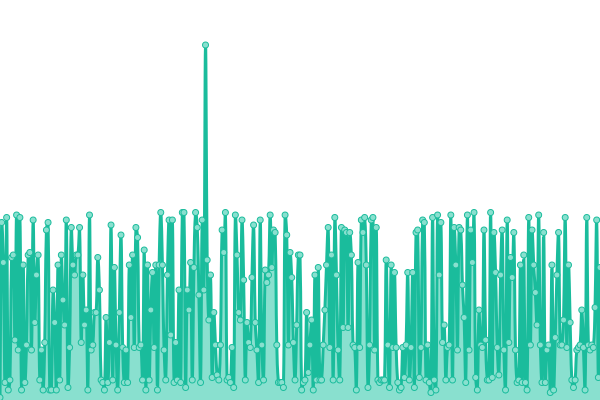
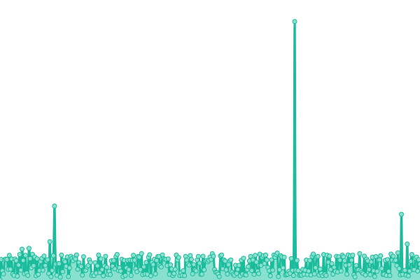
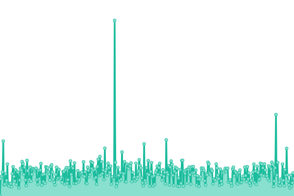

# [📈 Live Status](https://Data-Innova.github.io/monitoreo-compliance): <!--live status--> **🟧 Partial outage**

This repository contains the open-source uptime monitor and status page for [Data Innova](www.datainnova.co), powered by [Upptime](https://github.com/upptime/upptime).

With [Upptime](https://upptime.js.org), you can get your own unlimited and free uptime monitor and status page, powered entirely by a GitHub repository. We use [Issues](https://github.com/Data-Innova/monitoreo-compliance/issues) as incident reports, [Actions](https://github.com/Data-Innova/monitoreo-compliance/actions) as uptime monitors, and [Pages](https://Data-Innova.github.io/monitoreo-compliance) for the status page.

<!--start: status pages-->
<!-- This summary is generated by Upptime (https://github.com/upptime/upptime) -->
<!-- Do not edit this manually, your changes will be overwritten -->
<!-- prettier-ignore -->
| URL | Status | History | Response Time | Uptime |
| --- | ------ | ------- | ------------- | ------ |
|  [Compliance - Batch](https://app.compliance.com.co/validador/healthBatch/healthChecks/health) | 🟥 Down | [compliance-batch.yml](https://github.com/Data-Innova/monitoreo-compliance/commits/HEAD/history/compliance-batch.yml) | 

 268ms
     
 | 

<a href="https://status.compliance.com.co/history/compliance-batch">99.53%</a>
    

|  [Compliance - Back Web](https://app.compliance.com.co/validador/apiPublica/healthChecks) | 🟩 Up | [compliance-back-web.yml](https://github.com/Data-Innova/monitoreo-compliance/commits/HEAD/history/compliance-back-web.yml) | 

 32ms
     
 | 

<a href="https://status.compliance.com.co/history/compliance-back-web">99.53%</a>
    

|  [Compliance - WebService](https://app.compliance.com.co/validador/healthWs/healthChecks) | 🟩 Up | [compliance-web-service.yml](https://github.com/Data-Innova/monitoreo-compliance/commits/HEAD/history/compliance-web-service.yml) | 

 32ms
     
 | 

<a href="https://status.compliance.com.co/history/compliance-web-service">99.53%</a>
    

|  [Compliance - Front Web](https://validador.compliance.com.co/) | 🟩 Up | [compliance-front-web.yml](https://github.com/Data-Innova/monitoreo-compliance/commits/HEAD/history/compliance-front-web.yml) | 

 222ms
     
 | 

<a href="https://status.compliance.com.co/history/compliance-front-web">100.00%</a>
    

|  [Compliance - Pagina Web](https://compliance.com.co/) | 🟩 Up | [compliance-pagina-web.yml](https://github.com/Data-Innova/monitoreo-compliance/commits/HEAD/history/compliance-pagina-web.yml) | 

 630ms
     
 | 

<a href="https://status.compliance.com.co/history/compliance-pagina-web">100.00%</a>
    

<!--end: status pages-->

[**Visit our status website →**](https://Data-Innova.github.io/monitoreo-compliance)

## 📄 License

- Powered by: [Upptime](https://github.com/upptime/upptime)
- Code: [MIT](./LICENSE) © [Anand Chowdhary](https://anandchowdhary.com), supported by [Pabio](https://pabio.com)
- Data in the `./history` directory: [Open Database License](https://opendatacommons.org/licenses/odbl/1-0/)
